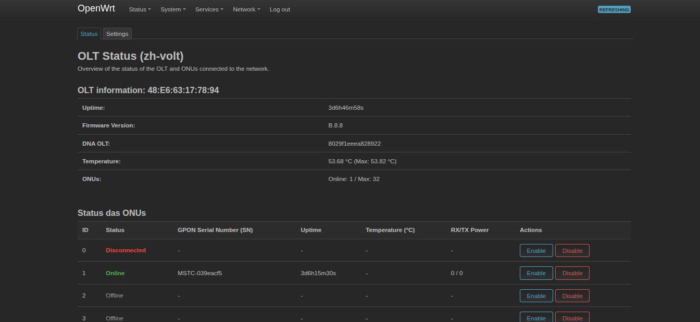

# ZH-Volt

Tool to manager zh-volt OLT for 16, 32 or 64 ONUs.



## What's working for now?

Currently we have few things that you can change, or visualize, the following things are possible:

- View OLT Temperature
- OMCI mode
- ONU Connection Time and OLT Uptime
- Connected ONUs
- ONU Status (Partially mapped)
- GPON SN also

## Openwrt Luci

Add feed to `feeds.conf` or `feeds.conf.default`

```
src-git zhvolt https://sirherobrine23.com.br/Sirherobrine23/zh-volt.git
# or
src-git zhvolt https://github.com/Sirherobrine23/zh-volt.git
```

add this packages: `zh_volt` for cli/daemon and `luci-app-zh-volt` for luci application
